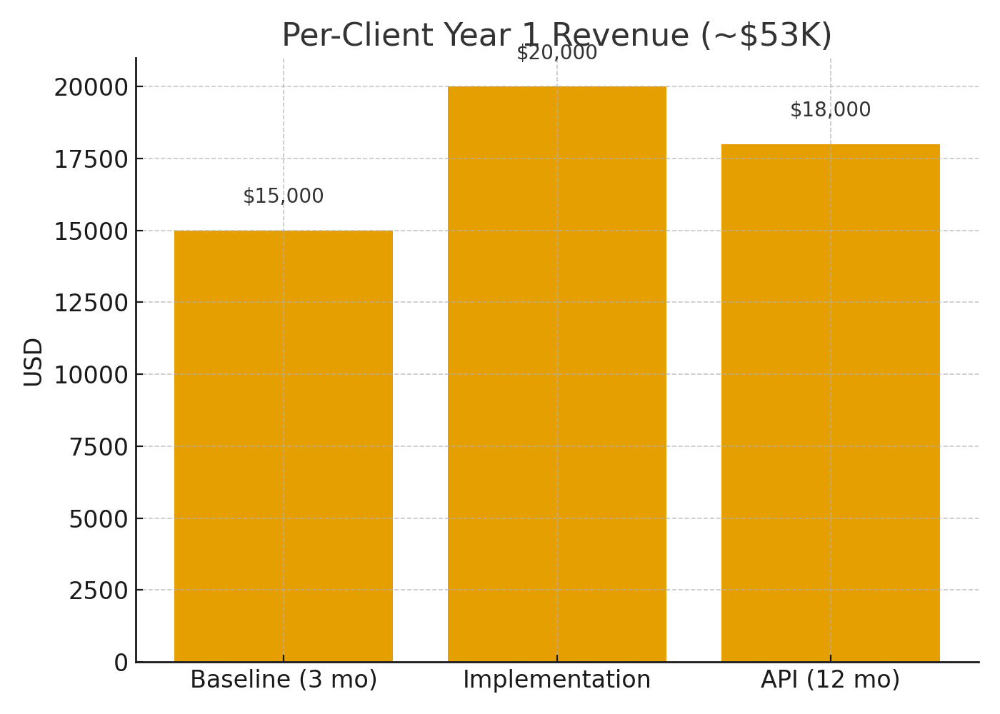
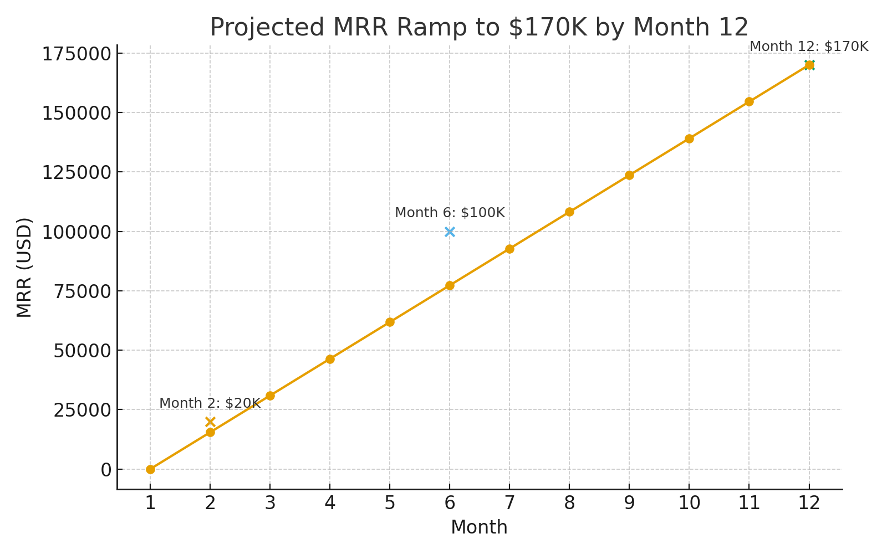
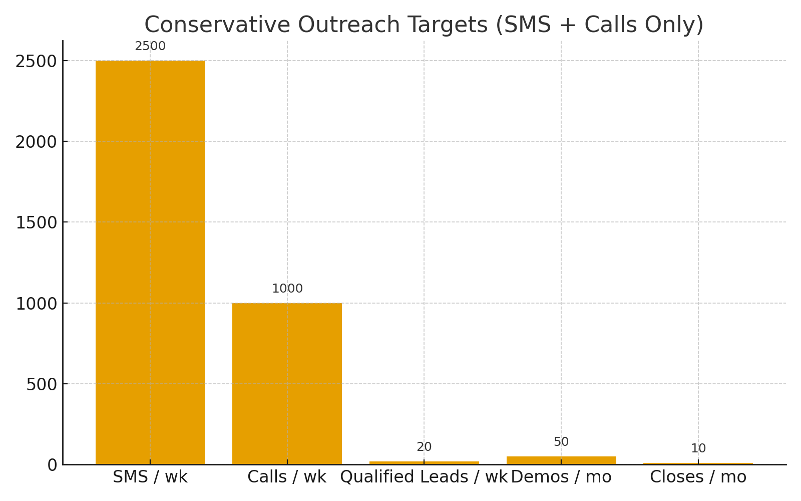
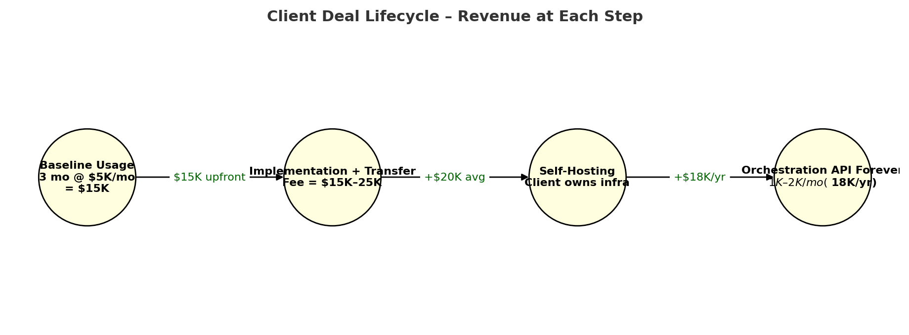

# White Label + Self-Hosting Playbook

## Model in 3 Phases
1. **Baseline Usage (Months 1–3)** — $5K/mo while we host = **$15K**.
2. **Implementation + Transfer (Month 4–6)** — Client becomes **self-hosted**. One-time fee **$15K–25K** (avg $20K).
3. **Orchestration API Forever** — $1K–2K/mo for centralized API access (**~$18K/yr**, 95% margin).

**Per Client Year 1 Value:** ~**$53K**. Target **38 clients** in 12 months → ~$2M ARR.

## Outreach Baseline (SMS + Calls Only)
- **2,500 SMS/week** (3–5% reply) → 60–125 replies
- **1,000 calls/week** (15–20% connect) → 120–200 convos
- **15–20 qualified leads/week**
- **40–50 demos/month**
- **8–10 closes/month** (need only ~3 to stay on plan)

## Ideal Clients
Mid-market enterprises ($10M–$100M), agencies (CRM/marketing/recruiting), and SaaS teams wanting data ownership + no vendor lock-in.

---
This document is client-shareable.
